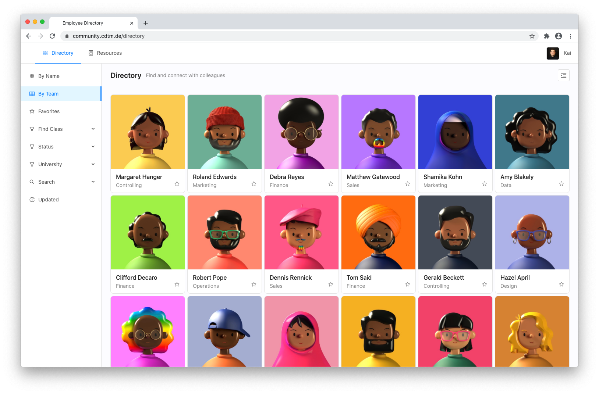
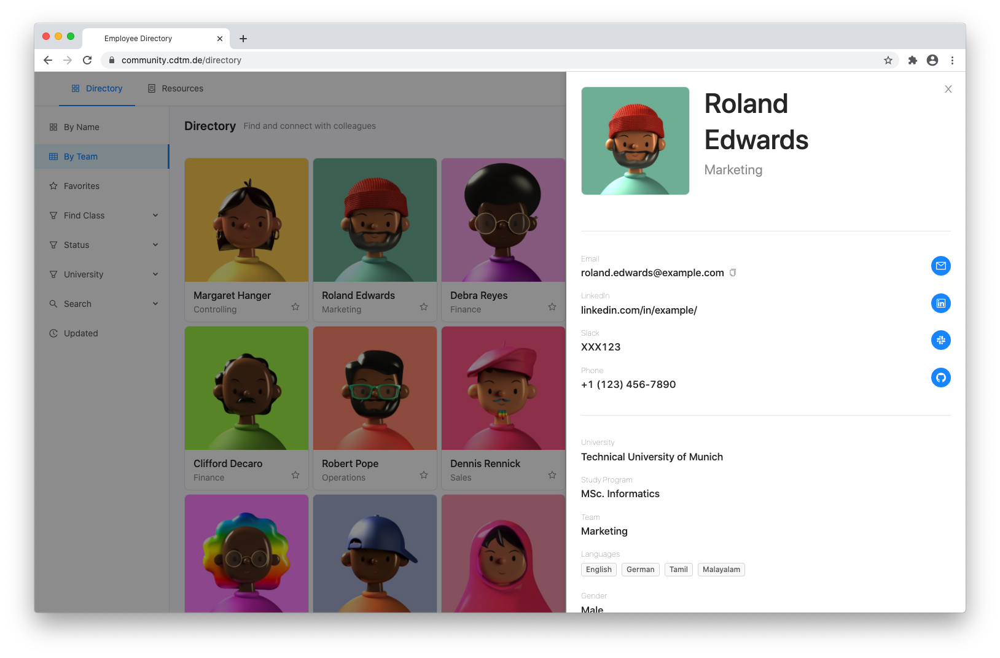

# Employee Directory

Connecting colleagues - a visual employee directory and resources app to enable personal relationships in a home office environment.

**Problems:** Increased isolation through online communication and virtual meetings; reduced collaboration and interaction between cross-functional teams (silo knowledge); scattered contact information and cumbersome user experience.
Growing organizations face a mutual challenge in retaining personal connections in the workforce and evolving a distinctive culture in times of high turnover rates and increasing remote work.

**Solution:** This project is an intuitive directory where employees can find and connect with colleagues. All information about an employee is available on one card with a photo: role, team, contact handles, goals, skills, interests, and custom fields. Users can be bookmarked, searched, and filtered. Companies benefit from increased team awareness and collaboration, continued learning, and lower employee churn. 






## Local Development Setup

Clone down this repository. You will need node and npm installed globally. Ask maintainers for the `.env` file.

Installation of requirements: `npm install`

To start the development server: `npm start`

Visit app: http://localhost:3000/

## Backend

The project builds on Firebase as a backend for agile development. Firebase Auth, Firestore, Storage, and Functions are used. Cloud functions and security rules (Firestore and Storage) are deployed from other repositories which are closed to protect the security logic. Please reach out to the maintainers.

The main Firestore database is backed up daily through a Cloud Function.

## Structure

```
├── CONTRIBUTING.md
├── README.md
├── netlify.toml
├── package-lock.json
├── package.json
├── public
│   ├── favicon.ico
│   ├── index.html
│   ├── manifest.json
│   └── static
│       ├── AvatarDefault.png
│       ├── icons
│       │   ├── directory.png
│       │   ├── modularized.png
│       │   ├── profile.png
│       │   └── resources.png
│       └── logo.png
└── src
    ├── App.css
    ├── App.js
    ├── App.test.js
    ├── components
    │   ├── Account
    │   │   └── index.js
    │   ├── Admin.js
    │   ├── Avatar
    │   │   ├── ImageResize.js
    │   │   ├── Upload.js
    │   │   └── index.js
    │   ├── Directory
    │   │   ├── Card.css
    │   │   ├── Card.js
    │   │   ├── Filter.css
    │   │   ├── Filter.js
    │   │   ├── Profile.css
    │   │   ├── Profile.js
    │   │   ├── index.css
    │   │   └── index.js
    │   ├── Firebase
    │   │   ├── Firebase.js
    │   │   ├── FirebaseContext.js
    │   │   └── index.js
    │   ├── Landing.js
    │   ├── Login.js
    │   ├── Navigation
    │   │   ├── Auth
    │   │   │   ├── Mobile.css
    │   │   │   ├── Mobile.js
    │   │   │   └── index.js
    │   │   ├── Setup.js
    │   │   ├── SetupMobile.js
    │   │   └── index.js
    │   ├── Regionals
    │   │   └── index.js
    │   ├── Resources
    │   │   ├── Item.css
    │   │   ├── Item.js
    │   │   ├── ResourcePopup.js
    │   │   ├── Submit.css
    │   │   ├── Submit.js
    │   │   ├── dateFunctions.js
    │   │   ├── index.css
    │   │   └── index.js
    │   ├── Session
    │   │   ├── AuthUserContext.js
    │   │   ├── index.js
    │   │   ├── withAuthentication.js
    │   │   └── withAuthorization.js
    │   ├── Setup
    │   │   ├── Avatar.js
    │   │   ├── Basic.js
    │   │   ├── Extended.js
    │   │   ├── Setup.js
    │   │   └── index.js
    │   ├── UserForm
    │   │   ├── Basic.js
    │   │   ├── Extended.js
    │   │   └── index.js
    │   └── Verify.js
    ├── constants
    │   ├── about.js
    │   ├── cohorts.js
    │   ├── directory.js
    │   ├── firebaseAPI.js
    │   ├── options.js
    │   ├── resources.js
    │   ├── roles.js
    │   ├── routes.js
    │   └── userFormFields.js
    ├── index.css
    ├── index.js
    └── serviceWorker.js
```

## Contributing

Guiding principles and first steps are outlined in [CONTRIBUTING.md](CONTRIBUTING.md).
